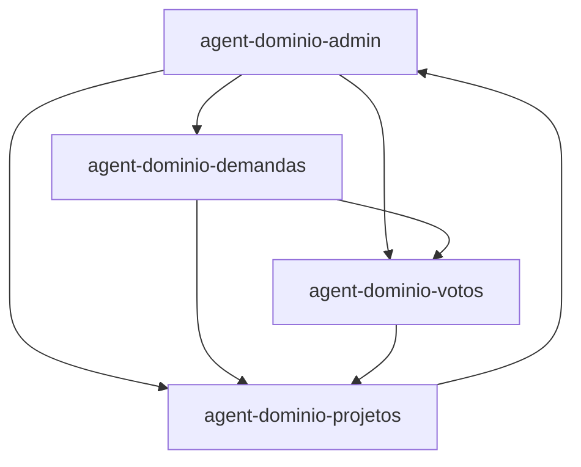

# Agent Topology — Deputado-Carlos-Burigo

## Agentes de Governança

| Agente | Papel |
|--------|-------|
| Supervisor | Orquestração — distribui tarefas, resolve conflitos, discovery |
| Architecture Review | Qualidade — revisa PRs, valida SOLID, acoplamento, duplicação, pode vetar mudanças |
| Context Manager | Documentação — ADRs, topologia de agentes, folder-structure, roadmap e decision-log |

## Agentes de Domínio

### agent-dominio-demandas
- **Objetivo**: Gerencia tudo relacionado a demandas públicas e cidadãs, incluindo protocolo, consulta e conformidade com Lei de Acesso à Informação
- **Escopo**: 
  - Permitido: `src/contracts/publicCommunication.ts`, `src/contracts/publicLegislative.ts`, `src/contracts/publicArchive.ts`, `src/components/citizen/**`, `api/documents.ts`, `api/media.ts`, `api/results.ts`, `api/agenda.ts` (parcial), `docs/P1-PUBLIC-*`, `documents/`
  - Proibido: `src/components/admin/**`, `api/projects.ts`, `api/news.ts`, `api/settings.ts`, `api/municipalities.ts`, `api/evidence.ts`, `api/votes.ts`, `src/types.ts` (exceção para tipos específicos de demandas)
- **Depende de**: agent-dominio-configuracoes, agent-dominio-municipios, agent-dominio-notificacoes
- **Dependido por**: Nenhum (agente de domínio primário)

### agent-dominio-admin
- **Objetivo**: Gerencia tudo relacionado ao domínio administrativo interno, incluindo autenticação, autorização, gestão de usuários e conteúdo institucional
- **Escopo**: 
  - Permitido: `src/components/admin/**`, `api/projects.ts`, `api/news.ts`, `api/documents.ts` (parcial), `api/media.ts` (parcial), `api/settings.ts`, `api/agenda.ts` (parcial), `api/votes.ts` (parcial), `api/results.ts` (parcial), `src/types.ts` (para tipos administrativos específicos), `docs/P1-ADMIN-*`
  - Proibido: `src/components/citizen/**`, `src/contracts/public*.ts`, `api/evidence.ts` (parcial - apenas se relacionado a administração de evidências), `api/municipalities.ts` (domínio de municípios - exceção para administração de dados municipais)
- **Depende de**: agent-dominio-demandas (para visualizar demandas), agent-dominio-municipios, agent-dominio-configuracoes, agent-dominio-notificacoes
- **Dependido por**: agent-dominio-demandas (para resposta a demandas), agent-dominio-votos (para apoio legislativo), agent-dominio-projetos (para gestão de projetos)

### agent-dominio-votos
- **Objetivo**: Gerencia tudo relacionado ao domínio legislativo e de votações, incluindo processamento de votações, gestão de pautas e calendário legislativo
- **Escopo**: 
  - Permitido: `api/votes.ts`, `api/agenda.ts` (parcial - componentes relacionados a votações e pautas), `api/results.ts` (parcial - resultados legislativos), `src/components/legislative/**` (se existir ou for criado), `src/contracts/publicLegislative.ts` (parcial - apenas aspectos legislativos), `docs/P1-LEGISLATIVO-*`, `src/types.ts` (para tipos legislativos específicos)
  - Proibido: `src/components/citizen/**` (exceto para visualização pública de votações), `src/components/admin/**` (exceto para apoio legislativo interno), `api/documents.ts` (parcial - apenas se relacionado a documentos legislativos), `api/news.ts`, `api/media.ts` (exceto para transmissão de sessões), `api/settings.ts`, `api/municipalities.ts` (exceto para relação com representantes municipais), `api/evidence.ts` (exceto para uso em processos legislativos)
- **Depende de**: agent-dominio-admin (para apoio administrativo), agent-dominio-midia (para transmissão e gravação), agent-dominio-configuracoes, agent-dominio-notificacoes, agent-dominio-demandas (para relação entre demandas e processos legislativos)
- **Dependido por**: agent-dominio-projetos (para aprovação legislativa de projetos)

### agent-dominio-projetos
- **Objetivo**: Gerencia tudo relacionado ao domínio de projetos e iniciativas parlamentares, incluindo planejamento, orçamentação, gestão de cronograma e avaliação de resultados
- **Escopo**: 
  - Permitido: `api/projects.ts`, `api/documents.ts` (parcial - documentos relacionados a projetos), `src/components/projects/**` (se existir ou for criado), `src/types.ts` (para tipos de projetos específicos), `docs/P1-PROJETOS-*`, `api/results.ts` (parcial - resultados relacionados a projetos), `api/agenda.ts` (parcial - compromissos relacionados a projetos)
  - Proibido: `src/components/citizen/**` (exceto para visualização pública de projetos), `src/components/admin/**` (exceto para apoio à gestão de projetos), `src/contracts/public*.ts` (exceto para referência a projetos), `api/news.ts` (domínio de notícias institucionais - exceto para divulgação de projetos), `api/media.ts` (domínio de mídia - exceto para cobertura de projetos), `api/settings.ts` (domínio de configurações gerais - exceto para configurações de projetos), `api/municipalities.ts` (domínio de municípios - exceto para projetos municipais específicos), `api/votes.ts` (domínio de votações - exceto para aprovação de projetos legislativos), `api/evidence.ts` (domínio de evidências - exceto para uso em avaliação de projetos)
- **Depende de**: agent-dominio-admin (para apoio administrativo), agent-dominio-votos (para aprovação legislativa), agent-dominio-configuracoes, agent-dominio-midia (para divulgação de resultados), agent-dominio-notificacoes (para alertas de marcos e entregas), agent-dominio-demandas (para identificação de necessidades que geram projetos)
- **Dependido por**: agent-dominio-votos (para projetos que requerem aprovação legislativa)

## Shared Kernel

- **Localização**: `src/types.ts`, `src/contracts/` (contratos públicos compartilhados)
- **Responsabilidade**: Tipos compartilhados, interfaces, enums e utilitários usados por múltiplos domínios
- **Acesso**: Todos os agentes podem ler, mas nenhum deve modificar diretamente
- **Governança**: Alterações exigem ADR e aprovação do Supervisor e Architecture Review

## Dependências entre Agentes

## Skills Obrigatórias por Agente

### agent-dominio-demandas
- api-patterns, database, ai-seo, web-perf, shadcn-ui, markdown

### agent-dominio-admin
- api-patterns, database, auth, react-patterns, testing, web-perf, observability

### agent-dominio-votos
- api-patterns, database, web-perf, shadcn-ui, markdown, csv, observability

### agent-dominio-projetos
- api-patterns, database, web-perf, react-patterns, charting, markdown, csv, observability